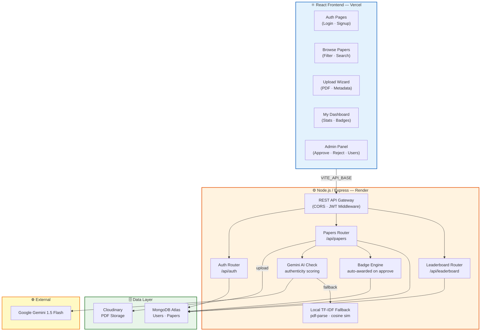

<div align="center">

# 📚 CampusPapers

**AI-Powered Academic Question Paper Repository**

Upload, discover, and verify past-year exam papers — with Gemini AI authenticity scoring, admin moderation, a badge system, and a live leaderboard.

<br>

[](https://campuspapers.vercel.app)
[](https://campus-papers.onrender.com)
[](LICENSE)

</div>

---

## ✨ Features

| Category | Description |
|---|---|
| **AI Authenticity Scoring** | Gemini 1.5 Flash analyzes every uploaded PDF to verify it is a real exam question paper relevant to the stated subject and department. Falls back to local TF-IDF scoring when offline. |
| **PDF Upload & Storage** | Secure multipart upload with 15 MB limit; PDFs stored on Cloudinary with automatic text extraction via `pdf-parse`. |
| **Admin Moderation** | Dedicated admin panel to review pending papers, approve or reject submissions, and manage users. Papers only appear publicly after admin approval. |
| **Badge & Achievement System** | Seven progressive badges awarded automatically on approval milestones — from *First Upload* to *Super Contributor* and *Popular*. |
| **Leaderboard** | Ranked boards for top contributors by approved upload count and by total paper views. |
| **JWT Authentication** | Secure signup/login with bcrypt password hashing and role-based access control (`student` / `admin`). |
| **Offline-Ready Browsing** | Filter papers by department, subject, and year; papers are always served from MongoDB Atlas with no client-side dependency on the AI service. |

---

## 🏗️ System Architecture



---

## 🔄 How It Works

### 1. Paper Upload & AI Scoring

When a student uploads a question paper, the system runs a four-stage pipeline:

1. **Validation** — The backend validates required metadata (department, subject, year, semester) and enforces a 15 MB file size limit.
2. **Cloudinary Upload** — The raw PDF buffer is streamed directly to Cloudinary, returning a permanent `secure_url`.
3. **AI Scoring** — The PDF text is extracted locally via `pdf-parse`. If `GEMINI_API_KEY` is configured, the extracted text and metadata are sent to **Gemini 1.5 Flash** with a structured prompt asking it to verify:
   - Is this a real exam question paper (numbered questions, marks allocation, exam format)?
   - Are the questions actually relevant to the stated subject and department?
   - Is it academic content — not a textbook, notes, or random document?
   
   Gemini returns `{ isAuthentic, authenticityScore (0–100), aiFeedback }`. If Gemini is unavailable, the system falls back to local TF-IDF cosine similarity against existing papers.
4. **Pending Queue** — The paper is saved with `status: "pending"` and enters the admin moderation queue.

### 2. Admin Moderation & Badge Awards

- Admins review all pending papers in the Admin Panel, with full metadata and the AI score visible.
- On **approve**, the paper becomes publicly visible and the `checkAndAwardBadges` engine re-evaluates the uploader's milestone progress, automatically granting any newly earned badges.
- On **reject**, the paper is hidden from all public views.

### 3. Leaderboard & Badges

Two live leaderboards rank students:
- **By Uploads** — sorted by number of approved papers
- **By Views** — sorted by total download/view count across their papers

Seven badges are awarded progressively:

| Badge | Trigger |
|---|---|
| First Upload | 1 approved paper |
| Contributor | 10 approved papers |
| Active Contributor | 50 approved papers |
| Super Contributor | 100 approved papers |
| Quality Contributor | 10+ approved papers |
| Top Contributor | 50+ approved papers |
| Popular | 1,000+ total views |

---

## 🛠️ Tech Stack

| Layer | Technology |
|---|---|
| **Frontend** | React 18 · Vite · Tailwind CSS · React Router |
| **Backend** | Node.js · Express · Mongoose (MongoDB Atlas) |
| **AI** | Google Gemini 1.5 Flash (`@google/generative-ai`) |
| **Storage** | Cloudinary (PDF hosting) |
| **Auth** | JWT (`jsonwebtoken`) · bcryptjs |
| **PDF Processing** | `pdf-parse` (text extraction) |
| **Deployment** | Vercel (frontend) · Render (backend) |

---

## 🚀 Quick Start

### 1. Clone

```bash
git clone https://github.com/smriti51818/campus-papers.git
cd campus-papers
```

### 2. Backend

```bash
cd backend
npm install
cp .env.example .env   # fill in values (see below)
npm run dev            # starts on :5000
```

### 3. Frontend

```bash
cd frontend
npm install
cp .env.example .env   # set VITE_API_BASE
npm run dev            # starts on :5173
```

---

## ⚙️ Configuration

### `backend/.env`

| Variable | Description |
|---|---|
| `MONGO_URI` | MongoDB Atlas connection string (URL-encode special chars in password) |
| `JWT_SECRET` | Random secret for signing tokens |
| `CLOUDINARY_CLOUD_NAME` | Cloudinary cloud name |
| `CLOUDINARY_API_KEY` | Cloudinary API key |
| `CLOUDINARY_API_SECRET` | Cloudinary API secret |
| `GEMINI_API_KEY` | Google AI Studio key — [get one free](https://aistudio.google.com) |
| `CLIENT_URL` | Frontend origin for CORS (e.g. `https://campuspapers.vercel.app`) |
| `PORT` | Server port (default `5000`; Render uses `10000`) |

### `frontend/.env`

| Variable | Description |
|---|---|
| `VITE_API_BASE` | Backend base URL (e.g. `https://campus-papers.onrender.com`) |

> **Vercel note:** `VITE_*` env vars must be set in the Vercel project dashboard — the `.env` file is gitignored and not deployed.

---

## 📡 API Reference

### Auth — `/api/auth`

| Method | Endpoint | Auth | Description |
|---|---|---|---|
| `POST` | `/signup` | — | Register a new student account |
| `POST` | `/login` | — | Authenticate and receive JWT |
| `GET` | `/admin/users` | Admin | List all registered users |
| `DELETE` | `/admin/users/:id` | Admin | Remove a user |

### Papers — `/api/papers`

| Method | Endpoint | Auth | Description |
|---|---|---|---|
| `GET` | `/papers` | Optional | Browse approved papers (filter by subject, department, year) |
| `GET` | `/papers/mine` | Student | Fetch the current user's uploaded papers |
| `GET` | `/papers/:id` | — | Fetch a single paper |
| `POST` | `/papers/upload` | Student | Upload a PDF with metadata — triggers AI scoring |
| `POST` | `/papers/:id/download` | — | Increment download counter |
| `PUT` | `/papers/:id` | Owner | Update paper metadata |
| `DELETE` | `/papers/:id` | Owner | Delete a paper |

### Admin — `/api/admin`

| Method | Endpoint | Auth | Description |
|---|---|---|---|
| `GET` | `/admin/papers` | Admin | All papers including pending (filter by `minScore`) |
| `PUT` | `/admin/papers/:id/approve` | Admin | Approve paper → auto-awards badges |
| `PUT` | `/admin/papers/:id/reject` | Admin | Reject paper |
| `DELETE` | `/admin/papers/:id` | Admin | Hard delete |

### Leaderboard — `/api/leaderboard`

| Method | Endpoint | Description |
|---|---|---|
| `GET` | `/leaderboard?type=uploads` | Top contributors by approved papers |
| `GET` | `/leaderboard?type=views` | Top contributors by total views |
| `GET` | `/badges/:userId` | Fetch a user's earned badges and stats |

---

## 📁 Project Structure

```
campus-papers/
├── frontend/                   # React + Vite SPA
│   └── src/
│       ├── pages/              # Login, Signup, Papers, Upload, Dashboard, Admin
│       ├── components/         # PdfPreview, shared UI
│       ├── context/            # AuthContext (JWT state)
│       └── utils/              # axios instance (api.js), download helper
├── backend/                    # Node.js / Express REST API
│   ├── routes/                 # auth.js · papers.js · leaderboard.js
│   ├── models/                 # User.js · Paper.js (Mongoose schemas)
│   ├── middleware/             # auth.js (JWT protect) · ownership.js
│   ├── utils/                  # cloudinary.js · geminiCheck.js · authenticityLocal.js · badges.js · jwt.js
│   └── scripts/                # seed.js · seed-real-papers.js · rescore-gemini.js · migrate_papers.js
└── ai-service/                 # Legacy Python FastAPI service (superseded by Gemini)
    ├── app.py
    └── ai_utils/               # extract_text.py · check_authenticity.py
```

---

## 🗃️ Database Scripts

```bash
# Seed 10 demo users and 10 real question paper PDFs from public university sources
# Downloads from VTU, Anna University, JNTU — uploads to Cloudinary and scores with Gemini
npm run seed:real

# Re-score all existing papers in the database using Gemini AI
npm run rescore
```

---

## 🌐 Deployment

| Service | Platform | Notes |
|---|---|---|
| Frontend | **Vercel** | Auto-deploy on push to `main`; set `VITE_API_BASE` in dashboard |
| Backend | **Render** | Node.js web service; set all backend env vars in dashboard |
| Database | **MongoDB Atlas** | M0 free tier; add `0.0.0.0/0` to Network Access for Render |
| Storage | **Cloudinary** | Free tier; no extra config needed beyond API credentials |
